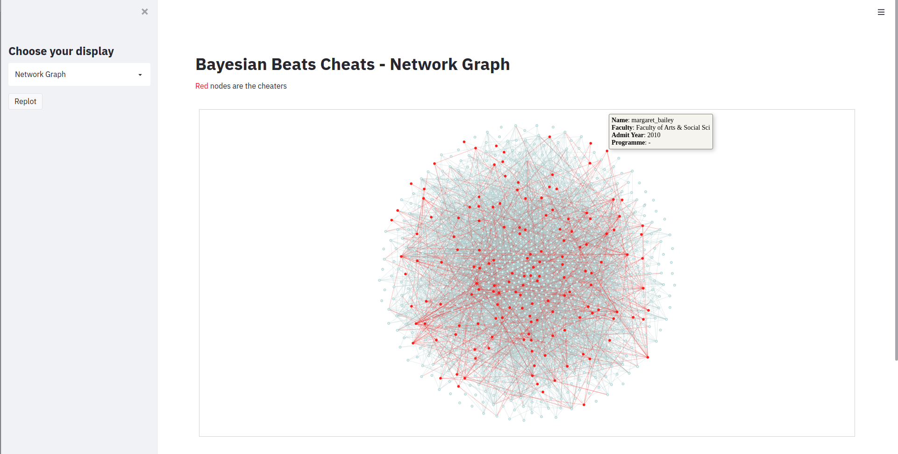

# Setup

1. Install streamlit, networkx, pyvis
   ```
   pip3 install -r requirements.txt
   ```
2. Debugging  
   Might have to run the following 2 commands:
   ```
   pip3 install --upgrade protobuf
   export PATH="$HOME/.local/bin:$PATH"
   ```

# Running streamlit

Run `streamlit run main.py`

# Result



# Layout

[https://blog.streamlit.io/introducing-new-layout-options-for-streamlit/](https://blog.streamlit.io/introducing-new-layout-options-for-streamlit/)

# Other nice stuff

Code Editor in streamlit
[https://share.streamlit.io/samdobson/streamlit-sandbox/main/app.py](https://share.streamlit.io/samdobson/streamlit-sandbox/main/app.py)
